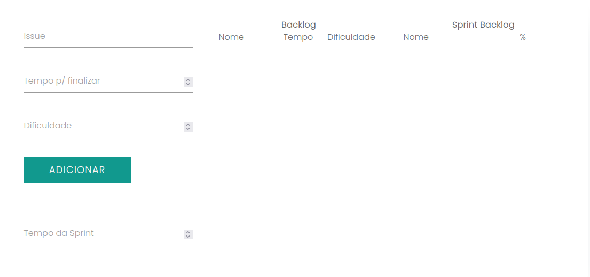
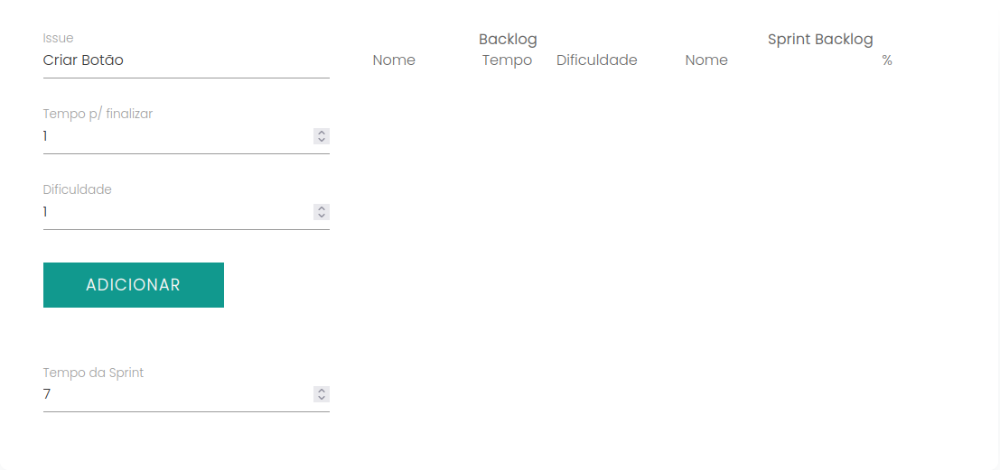
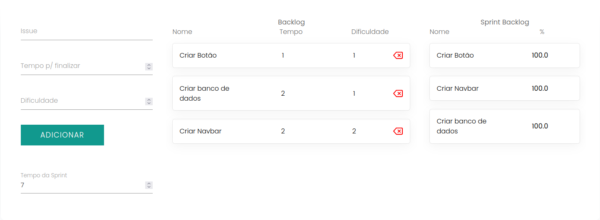
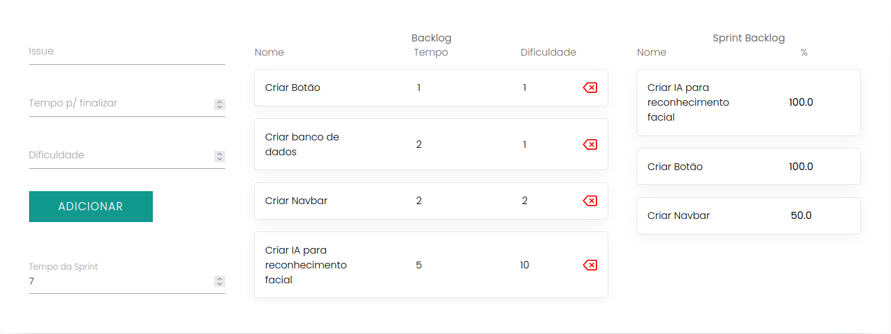

# Greed_Sprint_Organizer


**Número da Lista**: X<br>
**Conteúdo da Disciplina**: GREED<br>

## Alunos
|Matrícula | Aluno |
| -- | -- |
| 18/0113151 |  Eduardo Nunes Pícolo |
| 14/0065547  |  Roberto Martins da Nóbrega|

## Sobre 
Sistema para organizar issues de uma sprint otimizando as escolhas por provável tempo de conclusão.

## Screenshots






## Instalação 
**Linguagem**: JavaScript<br>
**Framework**: React JS<br>


Para rodar o projeto, você precisa seguir as seguintes instruções:

1. Clonar o repositório
```
git clone https://github.com/projeto-de-algoritmos/Greed_Sprint_Organizer.git
```

2. Entrar na pasta sprint_organizer e instalar as dependências por meio de:

```
yarn install
```

3. Inicializar a aplicação

```
yarn start
```
